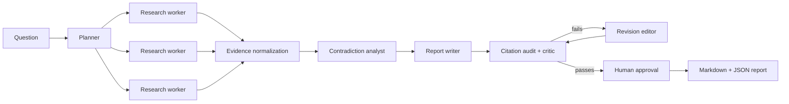

# Production Deep Research Agent

An evidence-first research system built with the OpenAI Agents SDK. It plans research, runs independent web-research workers in parallel, normalizes sources, detects contradictions, writes a cited report, audits citations, performs adversarial critique and revision, and requires approval before export.

This is not a search-and-summarize demo. The deterministic application layer owns the controls that language models should not own: concurrency, state, source IDs, deduplication, revision limits, persistence, citation gates, and publication approval.

## What makes it production-oriented

- Typed contracts between every agent stage
- Parallel research with bounded concurrency
- Primary-source and counterevidence policy
- Source canonicalization and deduplication
- Evidence-level provenance
- Contradiction and uncertainty analysis
- Deterministic citation integrity checks
- Adversarial critic and bounded revision loop
- Human approval before export
- SQLite run persistence and recovery artifacts
- Token, request, and stage-latency metrics
- OpenAI Agents SDK tracing
- Unit tests and an end-to-end evaluation harness
- CLI, Streamlit UI, Docker, and CI-ready tooling

## Workflow



See [docs/architecture.md](docs/architecture.md) for responsibilities and trust boundaries.

## Project structure

```text
production-deep-research-agent/
├── app/                    # Streamlit interface
├── docs/                   # Architecture, security, evaluation
├── evals/                  # Full-workflow evaluation dataset and runner
├── examples/               # Example request
├── src/deep_research_agent/
│   ├── agents.py           # Typed Agents SDK definitions
│   ├── workflow.py         # Deterministic orchestration
│   ├── citations.py        # Citation quality gate
│   ├── dedup.py            # Source/evidence normalization
│   ├── security.py         # Untrusted-content utilities
│   ├── storage.py          # SQLite persistence
│   └── metrics.py          # Usage and latency metrics
└── tests/                  # Deterministic unit tests
```

## Setup

Requirements: Python 3.11–3.14 and an OpenAI API key.

```bash
git clone https://github.com/thejenilsoni/master-ai-agents.git
cd master-ai-agents/openai-agents-sdk/advanced/production-deep-research-agent
python -m venv .venv
source .venv/bin/activate  # Windows: .venv\Scripts\activate
python -m pip install -e ".[dev]"
cp .env.example .env
```

Add `OPENAI_API_KEY` to `.env`.

## Run from the CLI

```bash
deep-research \
  "Which engineering patterns make production multi-agent systems reliable?" \
  --depth deep \
  --audience "AI engineering leaders" \
  --constraint "Prefer primary sources" \
  --recency-days 730
```

The CLI displays the critic score and citation-gate result before asking for approval. Approved reports are exported to `outputs/<run-id>/` as Markdown and JSON.

For non-interactive runs, `--auto-approve` still exports only when both the critic and citation gates pass.

## Run the Streamlit interface

```bash
streamlit run app/streamlit_app.py
```

## Quality checks

```bash
python selftest.py --selftest    # 38 checks, no API key and no network
make check                       # lint, types, and the same test suite
```

`--selftest` runs the test suite and adds checks over the two things this agent
is most dangerous to get wrong:

- **What it does with fetched pages.** Source content is attacker-controlled, so
  it is quoted between delimiters and screened for instruction-override,
  system-prompt extraction, citation suppression, and command execution — and
  content cannot write the delimiter itself to escape the quoted block.
- **When two sources are the same source.** Three URLs differing only by a
  trailing slash, a tracking parameter, or host case collapse to one, so a single
  page cannot masquerade as independent corroboration. The same claim from two
  *distinct* sources is deliberately kept, because that is corroboration.

Neither needs an API key. To run the live model evaluation:

```bash
python evals/run_eval.py
```

## Model routing

Defaults are intentionally configurable:

| Role | Default | Reasoning |
|---|---|---|
| Planning, synthesis, writing | `gpt-5` | high |
| Parallel research workers | `gpt-5-mini` | medium |
| Adversarial critic | `gpt-5` | high |

Override them through `.env`. This lets teams trade quality, latency, and cost without editing code.

## Failure behavior

- Each agent run has a maximum turn count.
- Parallelism and revision loops are bounded.
- Invalid typed outputs fail explicitly.
- Unknown citations or uncited factual paragraphs fail the citation gate.
- A missing approval callback leaves the report as an unapproved draft.
- Failed runs are recorded in SQLite with their error and collected metrics.

## Security

Read [docs/security.md](docs/security.md) before deploying. Web content is adversarial input. The included controls reduce risk but do not make arbitrary web research safe by default.

## Limitations

Citation validation currently verifies reference integrity and citation coverage, not full semantic entailment. The evaluation harness is a strong starting point, not a substitute for expert review. Search quality, model availability, pricing, and source access can change over time.

## License

MIT
