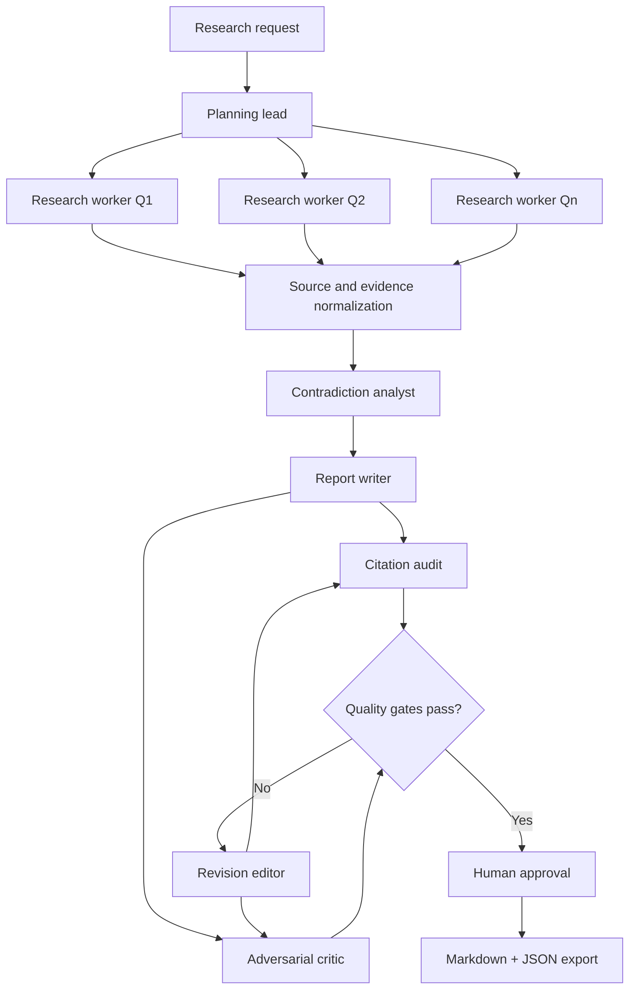

# Architecture

## Design goals

The system is evidence-first rather than prose-first. Research workers do not directly write the final report. They produce typed sources and evidence, which are normalized before analysis and writing.

## Why these agents exist

- **Planner:** decomposes scope and defines evidence requirements.
- **Research workers:** independently search assigned subquestions in parallel.
- **Analyst:** resolves conflicts across workers and identifies evidence gaps.
- **Writer:** turns verified evidence into audience-specific analysis.
- **Critic:** acts as an adversarial reviewer rather than a second writer.
- **Reviser:** applies bounded revisions against explicit quality failures.

The deterministic Python layer owns concurrency, storage, deduplication, citation auditing, revision limits, and approval policy. Models do not control those invariants.

## Trust boundaries

1. User requests are validated through Pydantic.
2. Web content is untrusted evidence, never executable instruction.
3. Only typed model outputs cross stage boundaries.
4. The writer receives normalized evidence instead of raw pages.
5. Citation IDs are checked deterministically.
6. Export is blocked until approval.
